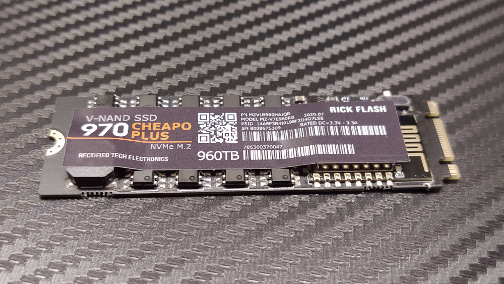
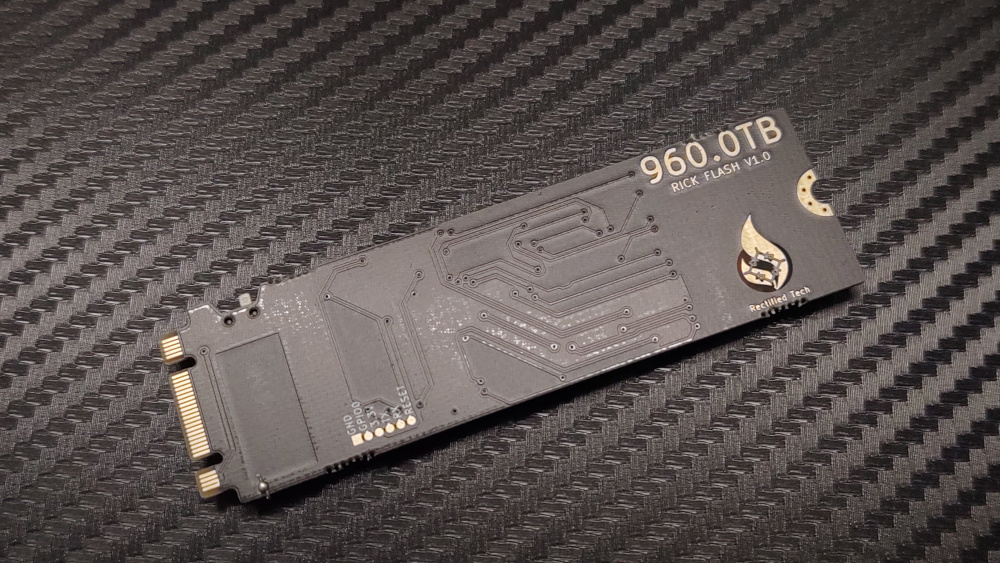
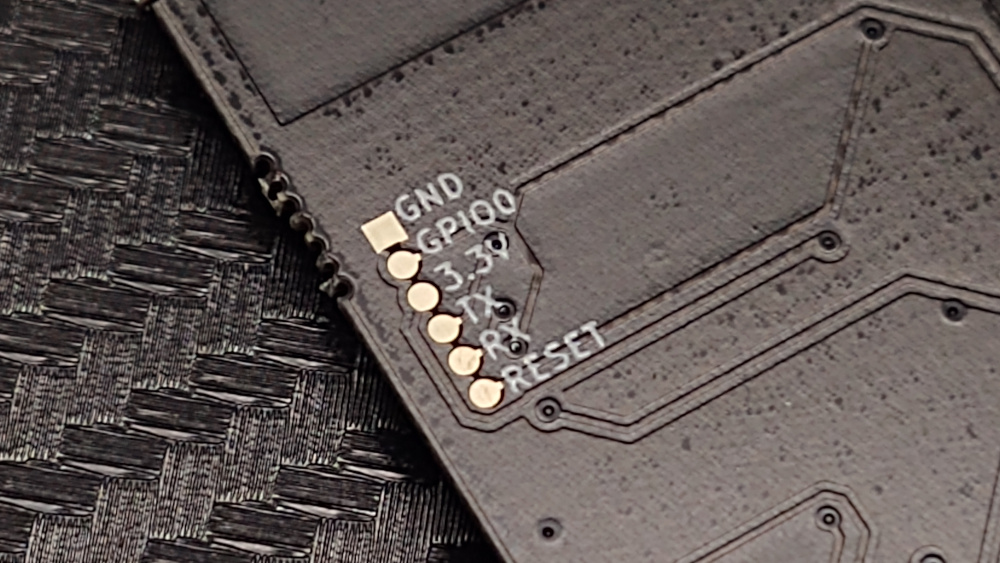

# Rick Flash v1.0

## Getting Started
1. Insert Rick Flash into an M.2 SSD slot, works with both SATA and NVME SSD slots (B+M Key), keep in mind that the module is a little wider and thicker than a standard M.2 SSD and may not fit in all laptops and desktops perfectly.
2. If the Rick Flash does not make any sound then slide the switch on the side of the M.2 module and try again, you should hear the tune start to play.

## WiFi Connection
### (MAY NOT WORK WITH SOME SAMSUNG PHONES)
When the Rick Flash is powered on it will play a short tune to the Rick Roll song known as “Never Gonna Give You Up” by Rick Astley (you probably already figured this out by now). The Rick Flash creates a WiFi access point called “Free WiFi!”, when connected to it via a phone or computer you will be redirected to a captive portal web page (you may have to tap on “Sign in to Free WiFi!”) on the device that displays “You Got Rick Rolled!!!” with a GIF of Rick Astley along with the lyrics to the song. You can also trigger the song to replay using the web page interface (See Below).

## Remote control over WiFi
1. Power on the Rick Flash and wait until the song stops playing.
2. Connect to the WiFi network called “Free WiFi!” and you should be redirected to a page with a GIF of Rick Astley.
3. Click on the hyperlink called “Click here to trigger the Rick Flash!” and it will replay the song on the Rick Flash remotely. Keep in mind that the WiFi connection may drop out during the song playback and you can only trigger it to replay after the song finishes.

## Programming Pads
The Rick Flash can be reprogrammed using the Arduino IDE and connecting the appropriate pins from a WEMOS D1 Mini Board (without the ESP module soldered) to the programming pads on the back of the M.2 module.

### Programming the ESP8266
Connect a headless WEMOS D1 Mini board to the Programming pads then upload your code using the arduino IDE with the WEMOS D1 Mini Board selected. Also make sure to write the html and image files to the ESP8266 via SPIFFS by selecting Tools --> ESP8266 Sketch Data Upload. You may need to add the ESP8266 boards to your boards manager as well as the libraries used in the original Arduino code.
